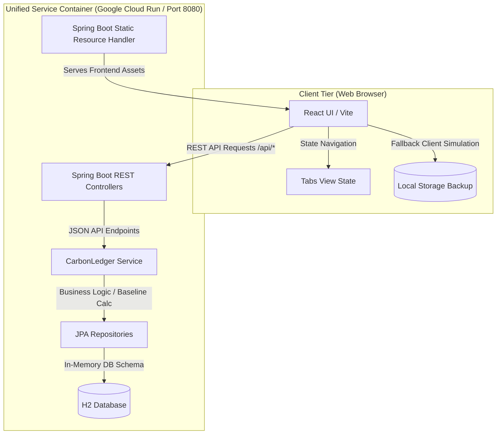

# 🌿 CarbonLedger

[](#)
[](LICENSE)
[](#)
[](#)

<p align="center">
  
</p>

## 📖 Overview
**CarbonLedger** is a personal carbon footprint calculator and gamified action tracker designed to help individuals measure emissions, log sustainable habits, and complete weekly challenges to reduce their carbon output. It empowers users to make sustainable lifestyle choices by showing tangible environmental equivalents (like trees planted and gasoline saved) for their actions.

### 🏗️ Architecture Design
CarbonLedger is designed as a unified single-container application. The React frontend is compiled into static assets and embedded inside the Spring Boot classpath resources (`src/main/resources/static/`). This allows a single Java process to serve the frontend UI and the REST API.




## 🎯 Challenge Submission Details

### 🏢 Chosen Vertical
Our selected hackathon vertical is **Sustainability & Climate Action (Carbon Ledger)**. The persona focuses on a personal carbon footprint tracking assistant that makes green habits fun, visual, and reward-driven.

### 🧠 Approach and Logic
- **Gamified Lifecycle**: Standard trackers fail due to lack of engagement. The approach centers on a **Weekly Quest Board** that gives users achievable, targeted goals (e.g. *Cold Wash Only, Meatless Week*) and tracks active/completed states in a local/cloud lifecycle.
- **Dynamic Micro-conversions**: Translates raw carbon savings (kg CO2e) into visual real-world equivalents (*trees planted, phones charged, gasoline saved*) to motivate user action.
- **Resource Constraints / CORS-Free**: Configured a unified architecture where React and Spring Boot execute in the same origin. By removing CORS restrictions entirely, we reduce browser overhead and prevent cross-origin request vulnerabilities.

### ⚙️ How the Solution Works
1. **Onboarding & Calculator**: User fills out a 4-step wizard about travel, food, energy, and consumption. The Spring Boot backend evaluates these baseline parameters using standardized EPA emission factors.
2. **Weekly Rotation**: Every Monday at midnight, a scheduled background job rotates available quests by pulling 3 random items from a pool of 16 templates. Completed and active quests are preserved.
3. **Action Logging**: Users can log daily green actions, which instantly updates their historical ledger (paginated database queries) and translates to positive equivalents.

### 📌 Assumptions Made
- **Emission Conversions**: Standardized conversions are used (e.g., 1 Tree grows in 1 year to absorb ~22 kg CO2; 1 Smartphone requires ~0.0083 kg CO2 to charge; 1 Liter of gasoline contains ~2.3 kg CO2).
- **Security Scope**: Since the database is an in-memory H2 database, authentication is simulated and mapped to a single session profile (Profile ID 1) for rapid prototyping and validation in the Cloud Run container sandbox.

## ✨ Features
- **Multivariate Carbon Calculator**: Computes baseline footprint across travel (car type, mileage, transit, flights), diet, home energy, and shopping habits.
- **Gamified Weekly Quest Board**: Rotates 3 sustainability challenges from a 16-challenge pool weekly using Spring Boot `@Scheduled` CRON schedules, with manual on-demand quest rolling and countdown timers.
- **Eco-Action Logging & Simulator**: Log carbon-reducing actions and view their real-world impact translated into trees planted, smartphones charged, and liters of gas saved.
- **Paginated Activity Ledger**: Keeps a detailed historical timeline of all logged actions and completed challenges.
- **Unified Single-Container Architecture**: Serves both the compiled React frontend assets and REST API endpoints from a single Spring Boot container.

## 🛠️ Tech Stack
- **Frontend**: React 18, Vite, Lucide Icons, Vanilla Glassmorphism CSS.
- **Backend**: Spring Boot 3.3.0, Java 21, Spring Data JPA, Hibernate.
- **Database**: H2 In-Memory database.
- **DevOps / Deployment**: Docker, Maven, Google Cloud Build, Google Cloud Run.

## 🚀 Getting Started

### Prerequisites
Make sure you have the following installed:
- **Java Development Kit (JDK) 21**
- **Apache Maven 3.8+**
- **Node.js v18+ & npm**
- **Docker** (optional, for container runs)

### Installation
Clone the repository and install dependencies for both services:

```bash
# Clone the repository
git clone https://github.com/vinish1997/CarbonLedger.git
cd CarbonLedger

# Install frontend dependencies
cd carbonledger/frontend
npm install

# Compile the backend
cd ../backend
mvn clean install
```

### Running the Application

#### Option 1: Running Separately (Local Dev)
1. **Start the Spring Boot backend**:
   ```bash
   cd carbonledger/backend
   mvn spring-boot:run
   ```
   *The backend will start on `http://localhost:8080`.*

2. **Start the React frontend**:
   ```bash
   cd carbonledger/frontend
   npm run dev
   ```
   *The frontend dev server will launch on `http://localhost:5173`.*

#### Option 2: Running the Unified Container (Docker)
Build and run the entire stack in one container:
```bash
# Navigate to context root
cd carbonledger

# Build the Docker image
docker build -t carbonledger .

# Run the container
docker run -p 8080:8080 carbonledger
```
*Access the unified web application at `http://localhost:8080`.*

## 📦 Usage Examples

Below is an example of the REST payload used to submit a baseline footprint calculation to the API:

```json
POST /api/calculator/calculate
Content-Type: application/json

{
  "carKmPerWeek": 150,
  "carType": "PETROL",
  "transitHoursPerWeek": 3,
  "flightsPerYear": 2,
  "dietType": "MEAT_LIGHT",
  "householdSize": 2,
  "homeEnergySource": "GRID",
  "heatingType": "GAS",
  "shoppingHabits": "AVERAGE"
}
```

Response payload containing category breakdowns and total footprint in tons CO2e/year:
```json
{
  "id": 1,
  "carKmPerWeek": 150,
  "carType": "PETROL",
  "transitHoursPerWeek": 3,
  "flightsPerYear": 2,
  "dietType": "MEAT_LIGHT",
  "householdSize": 2,
  "homeEnergySource": "GRID",
  "heatingType": "GAS",
  "shoppingHabits": "AVERAGE",
  "transportFootprint": 2.9,
  "dietFootprint": 1.7,
  "energyFootprint": 1.75,
  "consumptionFootprint": 1.0,
  "totalFootprint": 7.35
}
```

## 🔧 Configuration

### Environment Variables
Configure the following build/runtime variables as needed:

| Variable | Description | Default / Example |
| :--- | :--- | :--- |
| `VITE_API_BASE` | Target API base URL for frontend builds | `/api` |

## 🤝 Contributing
Contributions are welcome! Please feel free to open an issue or submit a pull request on our GitHub repository. For major changes, please open an issue first to discuss what you would like to change.

## 📄 License
This project is licensed under the [MIT License](LICENSE).
