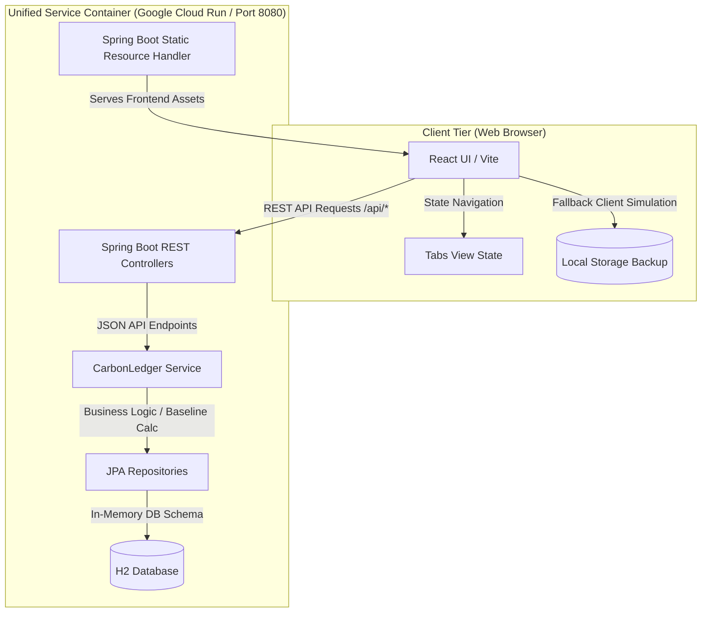

# CarbonLedger - Personal Carbon Footprint Tracker & Gamified Quests

**CarbonLedger** is a modern, game-like web application designed to help individuals calculate, track, and reduce their carbon footprint through simple actions and randomized weekly sustainability quests. 

---

## 1. System Architecture

CarbonLedger is designed as a unified single-container application. The React frontend is compiled into static assets and embedded inside the Spring Boot classpath resources (`src/main/resources/static/`). This allows a single Java process to serve the frontend UI and the REST API.



---

## 2. Core Features

### 1. Carbon Baseline Calculator
- Calculates carbon footprints across four key categories: **Transportation**, **Diet**, **Energy**, and **Consumption**.
- Provides customized recommendations based on driving distance, flight frequency, diet preferences, household size, and energy source profiles.

### 2. Gamified Weekly Quest Board
- Maintains an expansive pool of **16 sustainability challenges** (e.g. *Meatless Week, Digital Declutter, Zero Food Waste*).
- **Auto-Rotation Scheduler**: Rotates available challenges every Monday at midnight using Spring Boot's `@Scheduled` CRON processor.
- **Quest Reroller**: Allows users to manually roll a fresh set of challenges using a gamified "Roll New Quests" feature with spinning animations.
- **State Integrity**: Ensures active (accepted) and completed challenges are never lost or cleared during rotations.

### 3. Action Impact Simulator
- Log actions to calculate concrete savings.
- Displays overall environmental savings translated into equivalent real-world metrics:
  - 🌳 **Trees Planted Equivalent** (assumes 1 tree absorbs ~22kg CO2/year).
  - 📱 **Smartphones Charged**.
  - ⛽ **Liters of Gasoline Saved**.

### 4. Paginated Ledger History
- Keeps a detailed ledger of all logged actions and completed challenges with pagination.

---

## 3. Technology Stack

- **Backend**: Spring Boot 3.3.0, Java 21, Spring Data JPA, Hibernate, H2 In-memory database.
- **Frontend**: React 18, Vite, Lucide Icons, pure vanilla glassmorphism CSS styling.
- **Dockerization**: Multi-stage docker builds compiling React using Node 22 and packaging/running under Temurin JRE 21.

---

## 4. Local Development

### Running the Backend
From the `/carbonledger/backend` folder:
```bash
mvn spring-boot:run
```
*Server boots on `http://localhost:8080`*

### Running the Frontend
From the `/carbonledger/frontend` folder:
```bash
npm install
npm run dev
```
*Vite launches the local hot-reload server on `http://localhost:5173`*

---

## 5. Building the Unified Container Locally

To build and run the unified single-container application locally:

1. Navigate to `/carbonledger`:
   ```bash
   cd carbonledger
   ```
2. Build the Docker Image:
   ```bash
   docker build -t carbonledger:latest .
   ```
3. Run the Container:
   ```bash
   docker run -p 8080:8080 carbonledger:latest
   ```
4. Access the full application at: **`http://localhost:8080`**

---

## 6. Deploying to Google Cloud Run

We use continuous integration from GitHub using **Google Cloud Build** and **Cloud Run**:

1. Go to the [Google Cloud Console](https://console.cloud.google.com).
2. Go to **Cloud Run** and click **Create Service**.
3. Select **"Continuously deploy new revisions from a source repository"** and connect to this repository: `vinish1997/CarbonLedger`.
4. Configure the Build settings:
   - **Branch**: `^main$`
   - **Build Type**: `Dockerfile`
   - **Context directory**: `/carbonledger`
   - **Dockerfile path**: `Dockerfile`
5. Configure Instance Settings:
   - **Port**: `8080`
   - **Memory**: Set to **1 GiB** or **2 GiB** (Spring Boot minimum).
   - **Authentication**: Allow unauthenticated traffic.
6. Click **Create** to trigger your build and deployment!
